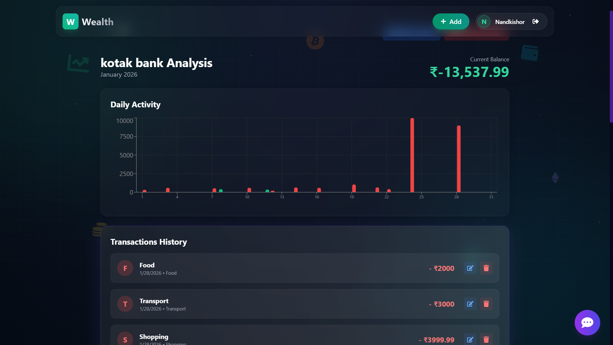
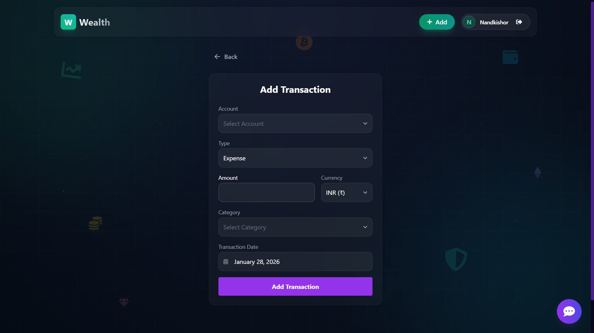
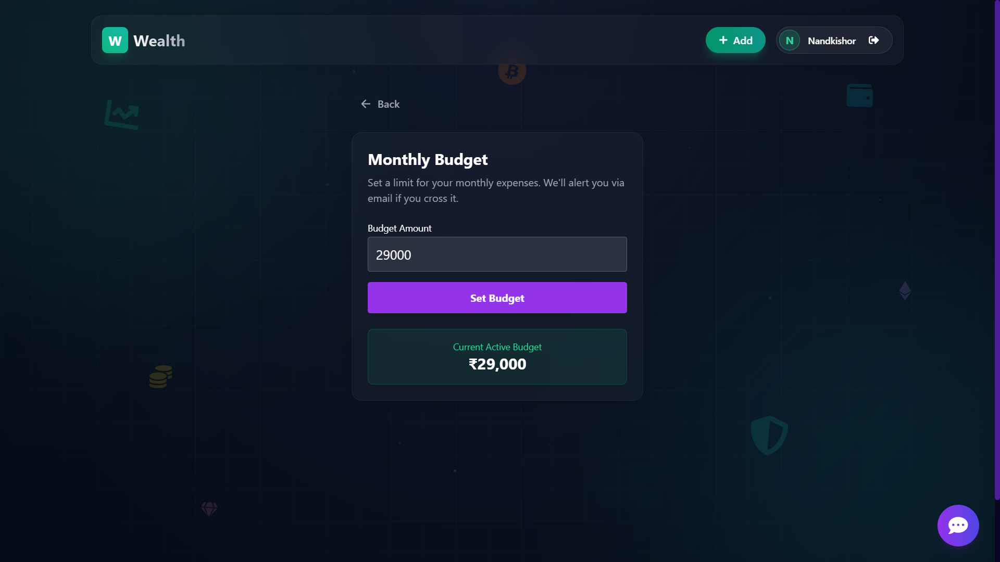
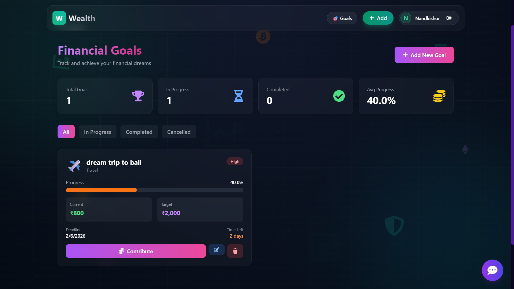
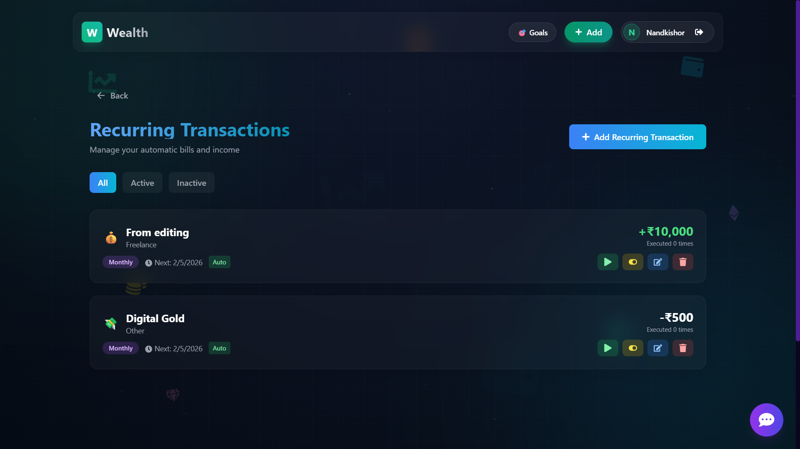
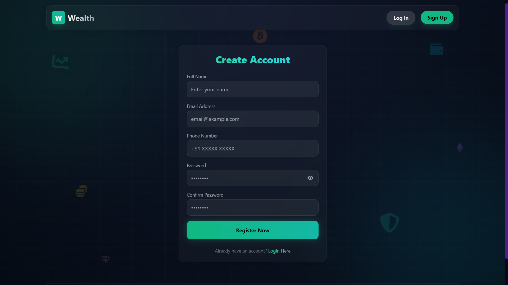
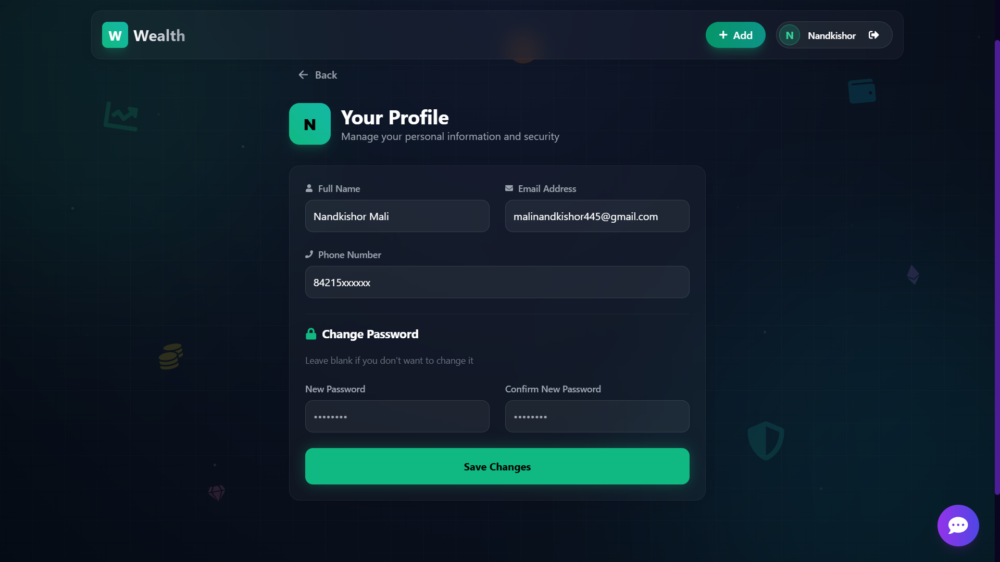

# 💰 Wealth - Smart Personal Finance Manager


> **Experience the future of personal finance management. Track, Analyze, and Grow your wealth with AI-driven insights.**

---

## 🌟 Overview

**Wealth** is a comprehensive, modern personal finance application designed to help you take control of your financial life. Built with a robust **MERN stack** and powered by **AI**, it offers seamless tracking of expenses, budgeting, and account management, all wrapped in a stunning, responsive interface.

Whether you are budgeting for the month, tracking your daily expenses, or analyzing your spending habits, Wealth provides the tools you need with a premium user experience.

---

## 📸 Screenshots

### 📊 Dashboard & Analytics
Get a bird's-eye view of your financial health with interactive charts and summaries.

<p align="center">
  
  
</p>

### 💸 Transactions & Budgeting
Easily add transactions and set budgets to keep your spending in check.

<p align="center">
  
  
</p>

### 🎯 Financial Goals & 🔄 Recurring Transactions
Set and achieve your financial dreams while automating your recurring bills and income.

<p align="center">
  
  
</p>

### 🔐 User Experience
Secure authentication and sleek profile management.

<p align="center">
  
  
</p>

---

## 🎯 Features in Action

### **Financial Goals Tracker**
- ✅ Create unlimited financial goals with custom categories
- ✅ Visual progress bars showing real-time achievement status
- ✅ Set priorities (High/Medium/Low) and deadlines
- ✅ Contribute towards goals from any linked account
- ✅ Automatic milestone tracking (25%, 50%, 75%, 100%)
- ✅ Beautiful goal detail pages with comprehensive analytics
- ✅ Edit goals on the fly or mark as completed/cancelled

### **Smart Budgeting System**
- ✅ Category-wise monthly budgets
- ✅ Real-time spending alerts at 80% and 100% thresholds
- ✅ Visual budget utilization graphs
- ✅ Email and WhatsApp notifications

### **AI-Powered Insights**
- ✅ Personalized saving tips based on your spending patterns
- ✅ Interactive finance advisor chatbot
- ✅ Monthly automated reports with AI-generated insights
- ✅ Spending trend analysis and predictions

---

## ✨ Key Features

### 🎯 **Financial Management**
-   **🎯 Financial Goals & Savings Targets**: Set, track, and achieve your financial dreams with visual progress tracking
    - Create multiple goals with deadlines and priorities
    - Track progress with beautiful visual indicators
    - Contribute towards goals with linked accounts
    - Milestone celebrations and deadline reminders
    - Goal categorization (Travel, Emergency, Investment, Education, Home, Vehicle, Wedding, Retirement)
-   **💳 Multi-Account Management**: Track various bank accounts, wallets, cash, credit cards, and crypto in one place
    - Real-time balance tracking
    - Account-wise transaction history
    - Set default accounts
    - Multi-currency support
-   **📅 Budget Planner**: Set monthly budgets and track your progress in real-time
    - Smart budget alerts at 80% and 100% thresholds
    - Category-wise budget breakdown
    - Budget vs actual spending comparison
-   **🔄 Recurring Transactions**: Automated transaction management with cron scheduler
    - Set up recurring income and expenses (Daily/Weekly/Monthly/Yearly)
    - Auto-generation of transactions
    - Manage subscriptions and bills
    - Upcoming transactions preview on dashboard
-   **📸 Receipt Scanning & OCR**: Effortless expense tracking with intelligent receipt scanning
    - Drag & drop or camera capture for receipt images
    - Automatic OCR text extraction using Tesseract.js
    - Smart parsing of amount, date, merchant, and category
    - Secure cloud storage with Cloudinary
    - One-click transaction creation from scanned receipts
    - Receipt gallery with filtering and search
    - Link receipts to transactions for proof of purchase


### 🤖 **AI-Powered Intelligence**
-   **🤖 AI Finance Advisor**: Integrated ChatBot powered by Groq SDK (LLaMA 3.3 70B)
    - Answer financial queries in real-time
    - Provide personalized financial advice
    - Interactive chat interface with context awareness
-   **💡 AI Saving Tips**: Category-based spending analysis with personalized recommendations
    - Smart suggestions based on spending patterns
    - Context-aware financial guidance

### 📊 **Analytics & Insights**
-   **💹 Comprehensive Dashboard**: Visual breakdown of your financial health using Recharts
    - Income vs Expense trends
    - Monthly spending patterns
    - Category-wise analysis
    - Savings tracker
    - Interactive charts and graphs
-   **📈 Account Analytics**: Deep dive into individual account performance
    - Transaction filtering and search
    - Historical data visualization
    - Balance trends over time

### 📱 **Multi-Channel Notifications**
-   **📧 Email Alerts**: Beautiful HTML email templates via Nodemailer
    - Budget warnings and threshold alerts
    - Monthly financial reports
    - Goal achievement notifications
-   **💬 WhatsApp Integration**: Real-time updates via Twilio
    - Budget alerts on the go
    - Monthly financial summaries
    - Customizable notification preferences
-   **🔔 Alert History**: Track all notifications sent to you

### 🎨 **Premium User Experience**
-   **🎨 Modern UI/UX**: Built with Tailwind CSS and Framer Motion
    - Glassmorphism design aesthetic
    - Smooth animations and transitions
    - Responsive layout for all devices
    - Dark mode with gradient accents
    - 3D tilt effects and spotlight cards
    - Custom floating background effects
-   **🚀 Performance**: Fast, responsive, and optimized
    - React 19 for maximum performance
    - Lazy loading and code splitting
    - Optimized bundle size

### 🔐 **Security & Privacy**
-   **🔒 Secure Authentication**: JWT-based authentication with BCrypt password hashing
    - Protected routes and authorization
    - Secure session management
    - Password encryption

---

## 🛠️ Technology Stack

### **Frontend (Client)**
*   **Framework**: React 19
*   **Styling**: Tailwind CSS
*   **Animations**: Framer Motion
*   **Routing**: React Router Dom 7
*   **Charts**: Recharts
*   **Form Management**: React Hook Form with Zod validation
*   **HTTP Client**: Axios
*   **Date Handling**: date-fns, Flatpickr
*   **Receipt Scanning**: Tesseract.js (OCR), react-dropzone

### **Backend (Server)**
*   **Runtime**: Node.js
*   **Framework**: Express.js
*   **Database**: MongoDB (Mongoose ODM)
*   **Authentication**: JWT (jsonwebtoken), BCrypt.js
*   **AI Integration**: Groq SDK (LLaMA 3.3 70B)
*   **Notifications**: 
    - Email: Nodemailer
    - WhatsApp: Twilio
*   **Receipt Processing**:
    - OCR: Tesseract.js
    - Image Storage: Cloudinary
    - Upload Handling: Multer
    - Image Processing: Sharp
*   **Task Scheduling**: node-cron (for recurring transactions and monthly reports)
*   **Environment**: dotenv

---

## 🚀 Getting Started

Follow these steps to run the project locally.

### Prerequisites
-   **Node.js** (v14 or higher)
-   **MongoDB** (local installation or MongoDB Atlas connection)
-   **npm** or **yarn** package manager

### 1. Clone the Repository
```bash
git clone <repository_url>
cd Wealth
```

### 2. Setup Backend (Server)
```bash
cd server
npm install
```

**Create a `.env` file in the `server` directory:**
```env
# Server Configuration
PORT=5000
NODE_ENV=development

# Database
MONGO_URI=your_mongodb_connection_string

# Authentication
JWT_SECRET=your_super_secret_jwt_key

# AI Integration
GROQ_API_KEY=your_groq_api_key

# Email Configuration (Optional but recommended)
EMAIL_HOST=smtp.gmail.com
EMAIL_PORT=587
EMAIL_USER=your_email@gmail.com
EMAIL_PASSWORD=your_app_specific_password

# WhatsApp/SMS Configuration (Optional)
TWILIO_ACCOUNT_SID=your_twilio_account_sid
TWILIO_AUTH_TOKEN=your_twilio_auth_token
TWILIO_PHONE_NUMBER=your_twilio_whatsapp_number

# Cloudinary Configuration (For Receipt Storage)
CLOUDINARY_CLOUD_NAME=your_cloudinary_cloud_name
CLOUDINARY_API_KEY=your_cloudinary_api_key
CLOUDINARY_API_SECRET=your_cloudinary_api_secret
CLOUDINARY_FOLDER=wealth-receipts

# Frontend URL
CLIENT_URL=http://localhost:3000
```

**Run the Server:**
```bash
npm start
```
The server will start on `http://localhost:5000`

### 3. Setup Frontend (Client)
Open a new terminal:
```bash
cd client
npm install
```

**Create a `.env` file in the `client` directory:**
```env
REACT_APP_API_URL=http://localhost:5000
```

**Run the Client:**
```bash
npm start
```

The application should now be running at `http://localhost:3000`! 🎉

---

## 📁 Project Structure

```
Wealth/
├── client/                  # React frontend
│   ├── public/             # Static assets
│   ├── src/
│   │   ├── components/     # Reusable UI components
│   │   ├── pages/          # Page components
│   │   │   ├── Dashboard.jsx
│   │   │   ├── Goals.jsx
│   │   │   ├── AddGoal.jsx
│   │   │   ├── EditGoal.jsx
│   │   │   ├── GoalDetail.jsx
│   │   │   ├── Transactions.jsx
│   │   │   ├── Budget.jsx
│   │   │   └── ...
│   │   ├── utils/          # Utilities and helpers
│   │   ├── App.jsx         # Main app component
│   │   └── index.js        # Entry point
│   └── package.json
│
├── server/                 # Express backend
│   ├── src/
│   │   ├── models/         # Mongoose models
│   │   │   ├── User.js
│   │   │   ├── Account.js
│   │   │   ├── Transaction.js
│   │   │   ├── Budget.js
│   │   │   ├── Goal.js
│   │   │   └── ...
│   │   ├── controllers/    # Route controllers
│   │   ├── routes/         # API routes
│   │   ├── middleware/     # Custom middleware
│   │   ├── services/       # Business logic & external services
│   │   └── utils/          # Helper functions
│   ├── server.js           # Entry point
│   └── package.json
│
└── README.md

```

## 🗺️ Roadmap & Future Features

### ✅ **Recently Completed**
- 🎯 Financial Goals & Savings Targets (Full implementation)
- 🔄 Recurring Transactions with automated processing
- 🤖 AI Finance Advisor ChatBot
- 📊 Enhanced Dashboard Analytics
- 📱 Multi-channel Notifications (Email + WhatsApp)
- 📸 Receipt Scanning & OCR (Fully Implemented)

### 🚧 **In Progress**
- 💰 Investment Portfolio Tracker
- 📈 Advanced Analytics Dashboard with AI predictions

### 📋 **Planned Features**
- 👥 Family/Shared Accounts
- 📦 Expense Splitting (Splitwise-style)
- 🎮 Gamification & Achievements
- 📱 Progressive Web App (PWA)
- 🔐 Two-Factor Authentication (2FA)
- 📊 Export Reports (PDF/Excel/CSV)
- 🌍 Enhanced Multi-Currency Support
- 🎯 Budget Templates
- 📞 Voice Commands for adding transactions

---

## 🌟 Why Wealth?

**Wealth** stands out from other finance apps because:

✨ **AI-Powered**: Leverages Groq's LLaMA 3.3 70B for intelligent financial advice  
🎨 **Beautiful UI**: Premium glassmorphism design with smooth animations  
🚀 **Modern Stack**: Built with latest React 19 and cutting-edge technologies  
📱 **Multi-Channel**: Stay informed via Email, WhatsApp, or in-app notifications  
🎯 **Goal-Oriented**: Unique visual goal tracking with milestone celebrations  
🔄 **Automated**: Smart recurring transactions and monthly reports  
💯 **Free & Open Source**: Complete transparency and customization freedom  

---

## 🤝 Contributing

We welcome contributions from the community! Here's how you can help:

### Ways to Contribute
- 🐛 Report bugs and issues
- 💡 Suggest new features or improvements
- 🔧 Submit pull requests
- 📖 Improve documentation
- ⭐ Star the repository if you find it useful!

### Development Workflow
1. Fork the repository
2. Create a feature branch (`git checkout -b feature/AmazingFeature`)
3. Commit your changes (`git commit -m 'Add some AmazingFeature'`)
4. Push to the branch (`git push origin feature/AmazingFeature`)
5. Open a Pull Request

---

## 📞 Support

If you need help or have questions:
- 📧 Open an issue on GitHub
- 💬 Join our community discussions
- 📖 Check the documentation

---

## 🙏 Acknowledgments

- **Groq AI** for the amazing LLaMA 3.3 70B model
- **Tailwind CSS** for the utility-first CSS framework
- **Framer Motion** for beautiful animations
- **Recharts** for interactive charts
- All open-source contributors who make projects like this possible!

---

## 📄 License

This project is licensed under the **ISC License**. Feel free to use, modify, and distribute as per the license terms.

---

<p align="center">
  <strong>Made with ❤️ and ☕ for better financial management</strong><br>
  <sub>⭐ Star this repository if you find it helpful!</sub>
</p>
