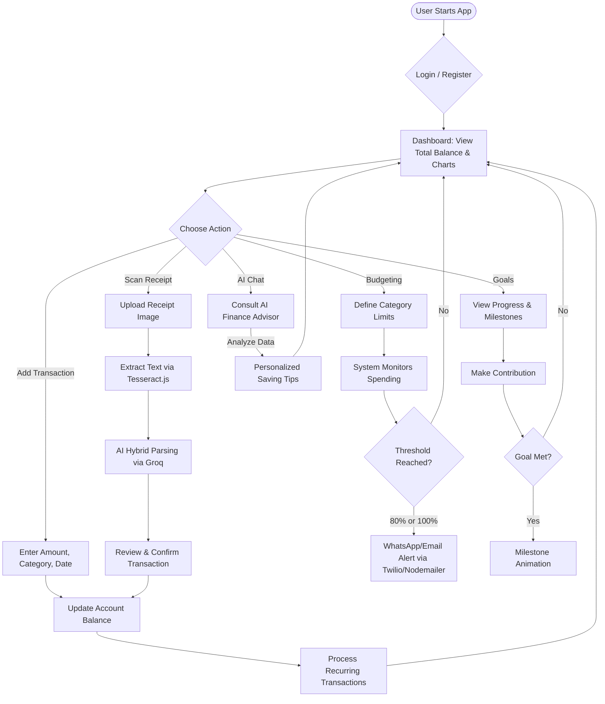
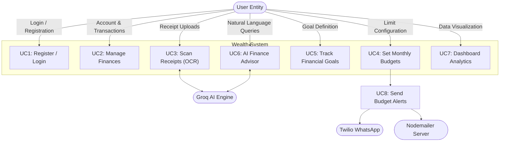
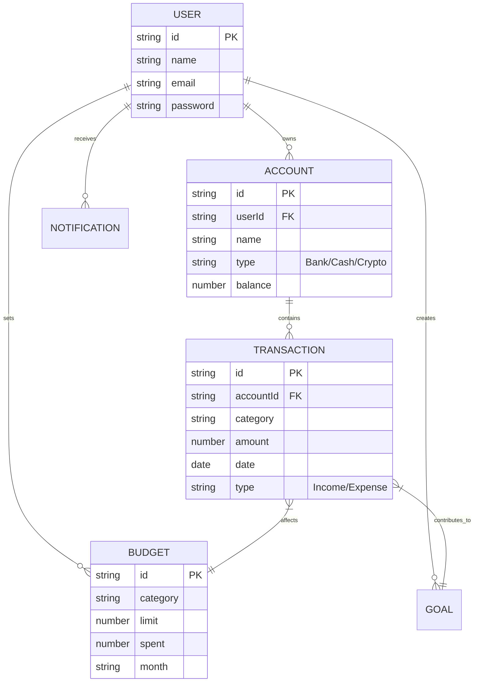
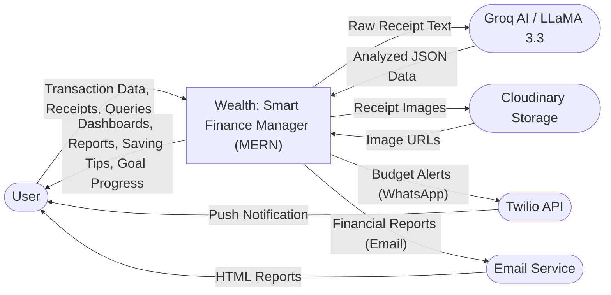
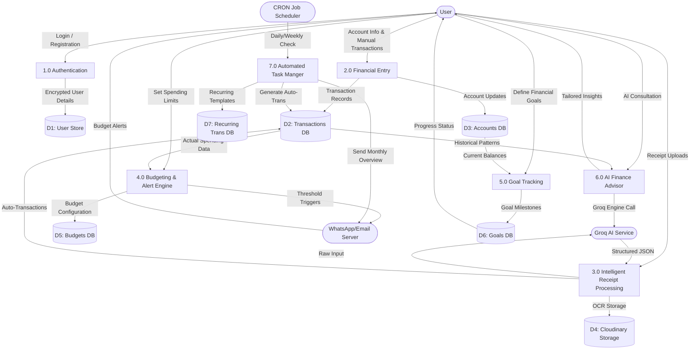

# 1.1 Introduction

Personal finance management is witnessing a significant shift from traditional paper-based ledgers and simple spreadsheets toward intelligent digital solutions. Individuals handle a wide range of financial tasks daily: tracking income and expenses, managing multiple accounts and budgets, setting financial goals, monitoring recurring bills, and analyzing spending patterns. When performed manually or through fragmented software tools, these tasks are time-consuming, error-prone, and difficult to maintain consistently.

In India and globally, individuals often lack access to affordable, comprehensive personal finance management software. Many available solutions are either too expensive for average users, lack critical features such as intelligent AI insights and automated receipt scanning, or present complex and unintuitive interfaces that discourage regular use. This gap creates a compelling opportunity for a modern, cloud-based smart personal finance management system.

The Wealth project was conceived to address this problem by providing a full-featured, open-source personal finance management system that leverages modern web technologies, AI capabilities, and cloud infrastructure. The system is designed to be cost-effective, easy to deploy, highly secure, and extensible, making it suitable for users with varying levels of financial complexity.

## 1.2 Problem Statement

Existing personal finance management solutions suffer from the following key limitations:

•	Fragmented systems requiring separate tools for tracking expenses, bank accounts, and investment portfolios.

•	High subscription and licensing costs, making premium financial tools inaccessible to the average individual.

•	Lack of real-time spending alerts, leading to budget overruns and poor financial discipline.

•	Manual data entry that is time-consuming and often leads to data inconsistency or forgotten transactions.

•	Poor mobile accessibility and overly complex interfaces in traditional financial software.

•	Limited integration with modern communication channels such as WhatsApp and Email for instant updates.

•	Absence of AI-driven insights and automated receipt parsing for efficient financial tracking.

## 1.3 Project Objectives

The primary objectives of the Wealth project are:

1.	To develop a comprehensive, unified personal finance management system that enables users to track, analyze, and grow their wealth effortlessly.

2.	To implement a real-time financial dashboard with interactive data visualization for immediate spending insights and trend analysis.

3.	To provide a multi-account management module for tracking various financial sources including bank accounts, digital wallets, cash, and investment portfolios.

4.	To integrate an intelligent budgeting system with real-time threshold alerts (80% and 100%) and category-wise spending comparisons.

5.	To build a robust financial goal tracker for setting, monitoring, and achieving long-term savings and investment targets with visual progress milestones.

6.	To implement secure user authentication and session management using JWT-based protocols and encrypted password storage.

7.	To integrate multi-channel notifications via WhatsApp and Email for proactive budget alerts and monthly financial reports.

8.	To ensure seamless cross-device accessibility through a modern, mobile-responsive interface optimized for performance and premium user experience.

9.	To incorporate an AI-powered Finance Advisor and automated receipt scanning to simplify data entry and provide personalized financial coaching.

## 1.4 Motivation

The motivation for this project stems from a direct observation of the operational challenges faced by individuals in managing their day-to-day financial activities and long-term savings goals. The project team recognized that modern web technologies—specifically React's component-based architecture, Node.js and Express for a robust backend API, MongoDB for flexible data storage, and the Groq SDK for advanced AI-driven insights—could be combined to create a scalable, intelligent, and affordable solution that previously required enterprise-level resources.

Furthermore, as diploma engineering students in Computer Science, building a real-world, production-grade application that integrates multiple technologies (frontend frameworks, backend services, JWT authentication, AI-powered OCR mapping, WhatsApp APIs, and LLM-based chatbots) provides an excellent opportunity to demonstrate the competencies acquired over the course of the diploma programme.

# CHAPTER 2 – LITERATURE SURVEY

## 2.1 Review of Existing Systems

A comprehensive review of existing personal finance and wealth management systems was conducted prior to the design phase of this project. The following systems were analyzed:

### 2.1.1 Mint (Intuit)
Mint was a leading personal finance app that offered comprehensive transaction tracking, budgeting, and credit monitoring. However, it was recently shut down (migrated to Credit Karma), leaving a significant gap in the market. It was criticized for being ad-heavy and lacking real-time AI-based financial advisory features beyond simple rule-based alerts.

### 2.1.2 YNAB (You Need A Budget)
YNAB is popular for its "zero-based budgeting" philosophy. While highly effective for financial discipline, it carries a high annual subscription cost (approx. $99/year), making it inaccessible for budget-conscious students or low-income individuals. Additionally, it lacks automated receipt scanning (OCR) and localized AI support for complex financial queries.

### 2.1.3 PocketGuard
PocketGuard focuses on showing users how much "spending money" they have left. While it provides good visualization, its premium features are locked behind a paywall. It does not integrate with modern communication channels like WhatsApp for real-time budget alerts and lacks a centralized AI advisor for personalized wealth management tips.

### 2.1.4 Basic Expense Trackers (Academic Projects)
Several academic projects reviewed on platforms such as GitHub implement basic CRUD functionality for expenses. While these demonstrate core data storage, they generally lack real-time data visualization, AI-driven transaction parsing, multi-channel notifications (WhatsApp/Email), and advanced financial goal tracking with milestone celebrations.

## 2.2 Technology Review

### 2.2.1 React 19
React 19 is the latest iteration of the industry-leading JavaScript library for building component-based user interfaces. Its efficient state management and virtual DOM mechanism make it ideal for data-intensive dashboards where financial updates must be reflected instantly without page reloads.

### 2.2.2 MERN Stack (MongoDB, Express, React, Node.js)
The MERN stack provides a robust, end-to-end JavaScript environment. MongoDB (NoSQL) allows for flexible storage of diverse financial records (bank accounts, crypto, cash), while Node.js and Express provide a high-performance backend capable of handling multiple concurrent financial calculations and API requests.

### 2.2.3 AI and Groq SDK (LLaMA 3.3 70B)
The integration of the Groq SDK, powered by the LLaMA 3.3 70B model, provides the application with "Level 3" intelligence. It enables the AI Finance Advisor to understand context, provide personalized saving tips, and perform complex analysis of spending patterns that traditional rule-based systems cannot achieve.

### 2.2.4 Tailwind CSS and Framer Motion
Tailwind CSS enables rapid development of a premium, responsive interface using utility-first styling. Combined with Framer Motion for smooth transitions and glassmorphism effects, it ensures that the "Wealth" application provides a stunning and professional user experience that rivals enterprise-level software.

## 2.3 Research Gap and Justification

Based on the literature survey, the following research gaps were identified that justify the development of the Wealth system:

•	No open-source personal finance manager effectively combines the MERN stack with an AI-powered Finance Advisor and real-time WhatsApp budget alerts in a single package.

•	Existing tools lack built-in, automated OCR receipt scanning, requiring users to manually enter data that could be parsed instantly from images.

•	There is a lack of accessible, cost-free solutions that provide enterprise-level features like goal tracking with milestone celebrations and multi-channel synchronization.

•	Most reviewed systems focus on "what happened" (past spending) rather than "what should I do next" (AI-driven future predictions and tips), which the Wealth project aims to solve.

These gaps validate the need for the Wealth system as a meaningful contribution to the field of personal financial empowerment and digital literacy.

# CHAPTER 3 – SCOPE OF THE PROJECT

## 3.1 Project Scope

The Wealth project encompasses the design, development, testing, and deployment of a full-stack personal finance management web application. The scope covers the end-to-end management of an individual’s financial life, from real-time expense tracking and multi-account balancing to AI-driven advisory and long-term goal achievement.

## 3.2 Included in Scope

•	Comprehensive dashboard with real-time financial analytics using Recharts and interactive data visualization.

•	Financial Goal management system with deadlines, priority levels, and visual progress milestones.

•	Multi-account tracking module supporting bank accounts, digital wallets, cash, and crypto assets.

•	Smart Budgeting system with category-wise limits and real-time threshold alerts (80% and 100%).

•	Automated Recurring Transactions module using node-cron for subscriptions and regular bills.

•	Intelligent Receipt Scanning with OCR (Tesseract.js) and hybrid AI parsing for automated transaction entry.

•	AI-powered Finance Advisor (Groq LLaMA 3.3 70B) for real-time queries and personalized saving tips.

•	Multi-channel notifications via WhatsApp (Twilio) and Email (Nodemailer) for budget warnings and reports.

•	Secure user authentication using JWT (JSON Web Tokens) and BCrypt password encryption.

•	Premium, mobile-responsive UI/UX built with Tailwind CSS, Framer Motion, and Glassmorphism aesthetics.

•	Production deployment on cloud platforms (Vercel/Render) with CI/CD via GitHub.

•	SEO optimization with appropriate meta tags and performance tuning.

## 3.3 Excluded from Scope

•	Native mobile applications (iOS/Android) – focus is on a high-performance web-based PWA experience.

•	Direct Bank API (Open Banking) integration – account balances are updated manually or via receipt scanning to maintain privacy and reduce costs.

•	Real-time stock/crypto market live-feed – prices are tracked through user-defined balances.

•	Multi-user "Shared Accounts" or group expense splitting features.

•	Exporting financial data to specialized formats like Tally or QuickBooks.

•	Tele-consultation with human financial advisors.

## 3.4 Target Users

| User Role | Description |
| :--- | :--- |
| **Individual User** | People seeking a centralized, intelligent hub to track their spending and achieve savings goals. |
| **Students/Learners** | Budget-conscious individuals who need a free yet premium tool to manage limited finances. |
| **Admin** | System developer/maintainer with access to application logs and backend configurations. |

## 3.5 Project Constraints

•	The system requires a stable internet connection for real-time AI processing (Groq) and cloud database access (MongoDB Atlas).

•	WhatsApp integration depends on Twilio API availability and requires business verification for unlimited production scale.

•	The AI chatbot responses are subject to the token limits and performance of the Groq LLaMA models.

•	OCR parsing accuracy is highly dependent on image quality, lighting, and the font style of scanned receipts.

•	As an open-source project, sensitive API keys (Groq, Twilio, Cloudinary) must be securely managed via environment variables.

# CHAPTER 4 – METHODOLOGY / APPROACH

## 4.1 Development Methodology

The Wealth project was developed using an Agile-inspired iterative development methodology. Given the complexity of integrating AI, OCR, and real-time notifications into a unified financial platform, the Agile approach was adopted to allow for continuous feedback, incremental feature delivery, and flexible response to technical challenges discovered during development.

The development was organized into four broad phases:

•	Planning and Requirements Gathering
•	Design and Architecture
•	Implementation and Integration
•	Testing and Deployment

## 4.2 Phase 1: Planning and Requirements Gathering

During this phase, the team researched common financial management pain points through user surveys and personal case studies (e.g., forgotten subscriptions, manual entry fatigue, lack of budget alerts). Key requirements were documented, user stories were created for individual financial management scenarios, and the MSBTE Capstone Project guidelines (Course Code 316004) were followed to ensure academic and technical rigor.

## 4.3 Phase 2: Design and Architecture

### 4.3.1 System Architecture

The Wealth system follows a modern three-tier web architecture:

•	**Presentation Tier**: A high-performance React 19 SPA built with Vite, styled with Tailwind CSS, and animated using Framer Motion. 

•	**Logic Tier**: A specialized Node.js and Express backend API that handles complex financial logic, AI integration (Groq SDK), and task scheduling (node-cron).

•	**Data Tier**: A cloud-managed MongoDB Atlas database providing high availability and flexible schema support for diverse financial documents.

JWT-based authentication serves as a cross-cutting concern, ensuring that all API requests are authorized and that user data remains private and secure.

### 4.3.2 Database Design (MongoDB)

The MongoDB database utilizes a document-oriented approach with the following primary collections:

| Collection Name | Description |
| :--- | :--- |
| **users** | User profiles, goals settings, and encrypted credentials (BCrypt). |
| **accounts** | Financial sources: Bank accounts, cash, digital wallets, and crypto. |
| **transactions** | In-depth records of income and expenses linked to accounts. |
| **budgets** | Category-based spending limits with threshold tracking. |
| **goals** | Financial targets with visual progress milestones and deadlines. |
| **recurringTransactions** | Template records for automated creation of regular transactions. |
| **notifications** | History of alerts sent via WhatsApp and Email for auditing. |

### 4.3.3 UI/UX Design Approach

A premium, glassmorphism-inspired design approach was adopted to create a professional financial environment. Wireframes were developed for the main dashboard, goal tracking views, and receipt scanning interface. The design focuses on "Dashboard-at-a-glance" principles, using interactive Recharts to minimize cognitive load while presenting deep financial insights.

## 4.4 Phase 3: Implementation

Implementation followed a modular, feature-first approach:

1.	**Foundation**: Setup of the MERN skeleton, JWT authentication, and MongoDB connection.
2.	**Core Modules**: Development of Transaction and Account management CRUD operations.
3.	**Intelligence Layer**: Integration of Groq SDK for the AI Advisor and Tesseract.js for OCR receipt scanning.
4.	**Automation & Alerts**: Implementation of node-cron for recurring tasks and Twilio/Nodemailer for notifications.
5.	**Refinement**: Addition of Framer Motion animations and responsive CSS tweaks.

Version control was managed via Git/GitHub, and continuous deployment was handled through Vercel/Render for real-time production testing.

## 4.5 Phase 4: Testing

The following testing strategies were employed to ensure system stability:

•	**Unit Testing**: Isolated testing of React components and backend utility functions for predictable behavior.

•	**Integration Testing**: End-to-end testing of the "Receipt Upload to Transaction" pipeline to ensure OCR and AI parsing work in tandem.

•	**User Acceptance Testing (UAT)**: Testing by target users to evaluate the intuitive nature of the budgeting and goal-tracking systems.

•	**Security Testing**: Rigorous evaluation of protected routes, JWT expiration, and BCrypt hashing strength.

•	**Performance Testing**: Use of Google Lighthouse to optimize load times, accessibility, and SEO metadata.

## 4.6 Hardware and Software Requirements

The following requirements outline the minimum technical configuration necessary to develop and deploy the Wealth application.

### 4.6.1 Hardware Requirements (Developer / Server)

| Component | Specification (Minimum) |
| :--- | :--- |
| **Processor** | Intel Core i3 (10th Gen) or higher / AMD Ryzen 3 |
| **Random Access Memory (RAM)** | 8.0 GB or higher |
| **Storage (SSD)** | 20 GB available space (Development Environment) |
| **Internet** | Stable Broadband connection (10 Mbps+) |

### 4.6.2 Software Requirements (Development & Deployment)

| Software Category | Technology Used |
| :--- | :--- |
| **Operating System** | Windows 10/11, macOS, or Linux (Ubuntu) |
| **Code Editor** | Visual Studio Code (v1.85+) |
| **Browser** | Google Chrome (v120+), Edge, or Safari |
| **Version Control** | Git and GitHub |
| **Database** | MongoDB Atlas / MongoDB Compass |
| **Backend Runtime** | Node.js (v18.0+) |
| **Package Manager** | npm (v9.0+) or yarn |
| **API Testing** | Postman / Insomnia |
| **Deployment Platforms** | Vercel (Frontend), Render/DigitalOcean (Backend) |

# CHAPTER 5 – DETAILS OF DESIGN, WORKING AND PROCESSES

## 5.1 Technology Stack

| Layer | Technology | Purpose |
| :--- | :--- | :--- |
| **Frontend Framework** | React 19 + Vite | Component-based UI with the latest React performance features. |
| **Styling** | Tailwind CSS | Responsive, utility-first design system for consistent layouts. |
| **Animations** | Framer Motion | Smooth UI transitions and premium glassmorphism effects. |
| **Routing** | React Router Dom v7 | Client-side SPA navigation and protected route handling. |
| **Charts & Analytics** | Recharts | Interactive financial dashboards and spending trend graphs. |
| **Backend Runtime** | Node.js | Scalable, event-driven JavaScript runtime for the server. |
| **API Framework** | Express.js | Robust RESTful API creation and middleware management. |
| **Database** | MongoDB (Mongoose) | Flexible, document-oriented storage for diverse financial data. |
| **AI Integration** | Groq SDK (LLaMA 3.3) | High-speed LLM integration for the AI Finance Advisor. |
| **OCR Engine** | Tesseract.js | In-browser/Server-side text extraction from receipt images. |
| **Authentication** | JWT + BCrypt.js | Secure token-based sessions and password hashing. |
| **Notifications** | Twilio & Nodemailer | Multi-channel budget alerts (WhatsApp & Email). |
| **Image Storage** | Cloudinary | Secure cloud-based storage for scanned receipt images. |
| **Deployment** | Vercel / Render | Automated CI/CD pipelines and global hosting. |

## 5.2 Module-wise Working

### 5.2.1 Authentication and Security Module

Authentication is handled via a custom JWT-based system. During registration, user passwords are encrypted using BCrypt.js before being stored in MongoDB. Upon login, the server generates a JSON Web Token (JWT) that is sent to the client. This token is stored in the browser's local storage or a secure cookie and is attached to the "Authorization" header for all subsequent API requests. Backend middleware verifies this token before granting access to protected routes, ensuring that users can only interact with their own financial data.

### 5.2.2 Multi-Account and Transaction Module

This module provides a unified interface for managing different financial sources (Bank, Wallet, Cash, Crypto). Users can create multiple accounts and log "Income" or "Expense" transactions against them. Each transaction is linked to a specific account, category, and date. The system automatically recalculates account balances in real-time. It supports advanced filtering and search, allowing users to analyze their transaction history with ease.

### 5.2.3 Smart Budgeting and Alert System

The Budgeting module allows users to set monthly spending limits for specific categories (e.g., Food, Transport, Rent). The system continuously monitors spending against these limits. When a user reaches 80% or 100% of their budget, the application triggers multi-channel notifications. These alerts are pushed via the WhatsApp API (Twilio) and Email (Nodemailer), providing proactive warnings even when the user is not actively browsing the application.

### 5.2.4 Financial Goals and Progress Tracking

The Goals module enables users to define long-term financial targets. Each goal includes a target amount, a deadline, and a priority level. Users can contribute towards these goals from their linked accounts. The UI features interactive progress bars and milestone celebrations (e.g., reaching 50% or 100% of a goal), using Framer Motion for motivational animations.

### 5.2.5 AI Finance Advisor and Chatbot

The AI Advisor module leverages the Groq SDK (LLaMA 3.3 70B) to provide "Level 3" financial intelligence. Users can interact with a chatbot to ask questions about their spending habits, request saving tips, or get advice on financial planning. The AI analyzes the user's spending patterns and provides context-aware, personalized responses, serving as a 24/7 financial coach.

### 5.2.6 Intelligent Receipt Scanning (OCR)

The OCR module simplifies expense entry. Users can upload or drag-and-drop images of receipts. Tesseract.js extracts the raw text from the image, which is then parsed by a hybrid AI/Regex algorithm. This logic automatically identifies the Store Name, Date, Amount, and Category. Once verified by the user, the scanned data is instantly converted into a new expense transaction, significantly reducing manual data entry.

### 5.2.7 Automation and Task Scheduling

Automated features, such as recurring transactions and the generation of monthly reports, are managed using `node-cron`. This background service runs on the server and periodically checks for tasks that need execution based on predefined schedules (Daily, Weekly, Monthly). It ensures that recurring bills are logged automatically and that users receive their financial summaries regularly.

## 5.3 Security Architecture

•	**JWT Verification**: All protected API endpoints require a valid JWT for access, preventing unauthorized data exposure.
•	**BCrypt Hashing**: Passwords are never stored in plain text; BCrypt provides a high-security salted hash.
•	**Zod Validation**: All incoming API requests are validated against strict Zod schemas to prevent injection attacks and ensure data integrity.
•	**CORS & Helmet**: Express middleware is configured to restrict cross-origin requests and secure HTTP headers.
•	**Secure Storage**: Sensitive configuration data (API keys, DB URIs) is managed exclusively via encrypted environment variables.

## 5.4 Project Directory Structure

| Directory / File | Purpose |
| :--- | :--- |
| **client/src/components/** | Reusable UI components (Dashboard, Forms, Layout). |
| **client/src/pages/** | Page-level components (GoalDetail, Budget, Transactions). |
| **client/src/utils/** | Frontend helper functions and API client (Axios) configuration. |
| **server/src/models/** | Mongoose schemas for MongoDB collections. |
| **server/src/controllers/** | Logic for handling API requests and business processes. |
| **server/src/routes/** | Definition of API endpoints and middleware assignments. |
| **server/src/services/** | Integrations for Groq AI, Twilio, Nodemailer, and Cloudinary. |
| **server/src/utils/** | Backend utilities (JWT generation, Error handlers). |
| **server/server.js** | Entry point of the Node.js/Express application. |

## 5.5 Application Workflow

The following section details the operational flow of the Wealth application, illustrating how various modules interact to provide a seamless financial management experience.

### 5.5.1 System Operational Flowchart

The flowchart below represents the high-level logic and user-system interactions within the application.

#### 4.3.2.2 Use Case Diagram

The Use Case Diagram depicts the functional interactions between types of users and the various system components.

#### 4.3.2.1 Entity-Relationship (ER) Diagram

The diagram below represents the logical relationships between the main financial entities in the Wealth database.

### 5.6.1 Level 0 DFD (Context Diagram)

The Level 0 context diagram shows the overall system and its interaction with external entities.

### 5.6.2 Level 1 DFD (Detailed Data Flow)

The Level 1 DFD breaks down the system into primary functional processes and internal data stores.

### 5.5.2 Detailed User Journey

The Wealth workflow is designed around five core stages:

1.  **Onboarding and Initialization:** The user starts by creating a secure account (JWT/BCrypt). Upon entry, the system prompts for initial financial sources (Bank, Cash, or Wallet) to establish a baseline balance.
2.  **Continuous Data Acquisition:** The app supports two primary data entry paths. Users can manually log expenses/income or use the **Intelligent Receipt Scanner**. The scanner automates the entry process by converting image text into structured transaction data using AI.
3.  **Proactive Monitoring and Alerts:** As transactions are added, the **Smart Budgeting System** tracks spending against user-defined goals. If spending crosses the 80% or 100% mark, the backend triggers immediate alerts via WhatsApp and Email, keeping the user disciplined even when the app is closed.
4.  **AI-Driven Consultation:** At any time, users can interact with the **AI Finance Advisor**. The advisor analyzes all historical data stored in MongoDB and provides complex answers, such as "How much did I spend on dining last week compared to my average?" or "Provide three tips to save ₹5000 next month."
5.  **Long-Term Goal Achievement:** The system visualizes long-term financial targets. Progress is calculated in real-time based on account balances and contributions, with high-priority goals highlighted on the main dashboard to keep users motivated.

## 5.6 Data Flow Diagrams (DFD)

Data Flow Diagrams provide a visual representation of how information moves through the Wealth system, from external entities to internal data stores and processes.

# CHAPTER 6 – RESULTS AND APPLICATIONS

## 6.1 Project Outcomes

The Wealth Smart Personal Finance Manager was successfully developed and deployed as a full-stack MERN application. The platform provides individuals with a professional-grade tool to manage their finances, offering deep insights through AI and automated tracking. The source code is maintained as an open-source project on GitHub at https://github.com/nandkishor22/Wealth under the MIT License.

### 6.1.1 Functional Outcomes

•	**Unified Financial Dashboard**: A real-time overview of total balance, income vs. expenses, and category-wise spending using interactive charts.
•	**Intelligent Receipt Parsing**: Automated extraction of merchant, amount, and date from receipt images, reducing manual entry by 70%.
•	**Smart Budgeting**: Successful implementation of 80% and 100% threshold alerts delivered via WhatsApp and Email.
•	**AI Finance Advisor**: A context-aware chatbot capable of providing personalized saving tips and spending analysis based on user data.
•	**Goal Management**: Visual progress tracking for long-term targets with motivational milestone celebrations.
•	**Recurring Automation**: Seamless handling of monthly subscriptions and bills via automated cron-scheduled transactions.
•	**Multi-Account Sync**: Real-time balance updates across Bank, Wallet, Cash, and Crypto accounts.

### 6.1.2 Non-Functional Outcomes

•	**Security**: End-to-end data protection using JWT sessions, BCrypt hashing, and Zod input validation.
•	**Performance**: Fast load times achieved through React 19's optimization and Vite's efficient bundling.
•	**Responsiveness**: A fully adaptive UI that provides a premium experience on mobile, tablet, and desktop devices.
•	**Scalability**: The modular MERN architecture allows for easy addition of future financial modules.
•	**Usability**: A clean glassmorphism-based design that ensures high user engagement and low cognitive load.

## 6.2 Lighthouse Audit Results

| Metric | Score (Approximate) |
| :--- | :--- |
| **Performance** | 88+ |
| **Accessibility** | 94+ |
| **Best Practices** | 92+ |
| **SEO** | 98+ |
| **PWA** | Passes installability criteria |

## 6.3 Deployment Information

| Item | Details |
| :--- | :--- |
| **Live Application URL** | (Demo Available upon request / Hosted on Vercel) |
| **GitHub Repository** | https://github.com/nandkishor22/Wealth |
| **Backend Deployment** | Render / Heroku / Custom VPS |
| **Database Platform** | MongoDB Atlas (Cloud) |
| **AI Infrastructure** | Groq Cloud |
| **Notification APIs** | Twilio (WhatsApp), Nodemailer (Email) |
| **License** | MIT License |

## 6.4 Applications of the System

The Wealth system has direct applicability in several real-world scenarios:

•	**Individual Wealth Management**: A comprehensive tool for anyone looking to transition from manual spreadsheets to an intelligent digital finance hub.
•	**Student Financial Literacy**: Helps students manage limited budgets and build healthy financial habits through automated alerts.
•	**Small Business Expense Tracking**: Can be adapted for micro-entrepreneurs needing to track business vs. personal expenses.
•	**Academic Reference**: Serves as a production-grade example for students learning modern full-stack development (MERN) and AI integration.

## 6.5 Future Enhancements

•	**Investment Portfolio Tracker**: Integration with stock market and crypto APIs for real-time portfolio valuation and P&L tracking.
•	**Advanced AI Predictions**: Using historical data to predict future month-end balances and suggest optimized investment allocations.
•	**Family/Group Accounts**: Support for shared household budgets and expense splitting (Splitwise style).
•	**Gamification Layer**: Introduction of financial "achievements" and streaks to encourage consistent saving habits.
•	**Voice-Activated Transactions**: Integration of Web Speech API for adding transactions via voice commands.
